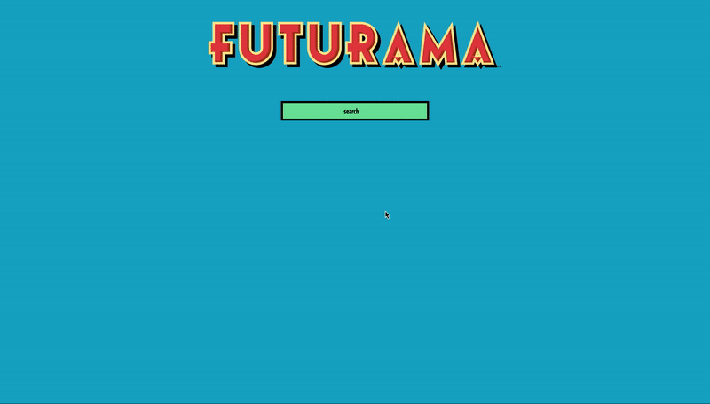
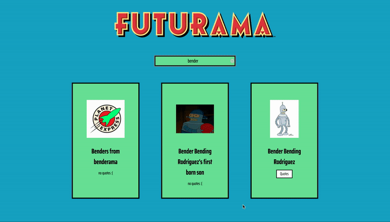

# about

Futurama Quotes is personal project that turned in to be a really nice and fun coding challenge. As a fan of Futurama, I wanted to develop an application where users can search for characters and see all their quotes.

# features

## search

Users are welcomed to the page with the Futurama logo and a search field. After the search for a favorite character, the results will be displayed in cards with the character's name and picture.



## quotes

For the characters that have available quotes a button will be displayed. Clicking on the button a modal will appear with the character's quotes. To go back to the search the user needs to hit the "back" button or close the modal.



# technologies

- React
- Redux

# instructions

1.  clone repository

    ```bash
    git clone https://github.com/ingriddorioschulze/futurama-quotes
    cd futurama-quotes
    ```

2.  install dependencies

    ```bash
    npm install
    ```

3.  start the application on your local machine

    ```bash
    npm start
    ```

# credits

- Futurama API
  https://futuramaapi.herokuapp.com/

#

with :yellow_heart: by [Ingrid do Rio Schulze](https://github.com/ingriddorioschulze)
